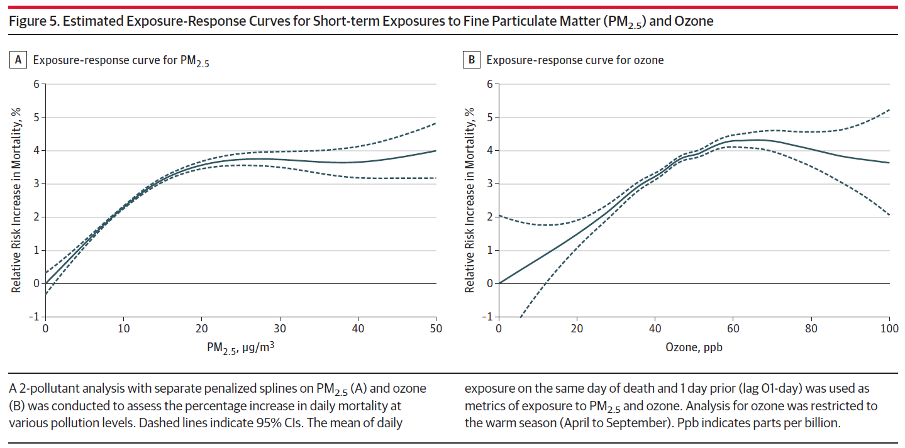

GAM Update Feb.26th
================

## Interpolating Pollution Fields with Addtional Road Effects

  - Overview

<!-- end list -->

1.  Data collection  
2.  Preparation of road effects 
3.  Application to the GAM model 

### 1\. Data Collection

#### 1.1. Pollution

  - Source: This study used a total of 76 monitoring stations around
    Seoul, of which 25 background stations and 15 roadside stations were
    stuated in Seoul, and 32 background stations and 4 roadside stations
    were spasely located within 10km distance from the city boundary.
  - Temporal period - daily: Hourly pollution measurements were
    aggreated to 12 hours and splitted as office and home hours. Office
    hours were assigned between 08 and 20 hour pollutants, while home
    hours were assigned between 21 and 07 hours.
  - Temporal period - seasonally: Summer 0725 - 0930; Winter 1202-0226

#### 1.2. Road

  - Source: Korean Transport Database (KTDB). Road rank info provides
    codes of road types.
  - 101: Highway, national
  - 102: Highway, urban
  - 103: National road
  - 104: Metropolitan road
  - 105: Rural road, govenment supported
  - 106: Rural road
  - 107: County road
  - 108: Highway ramp

### 2\. Preparation of road effects

#### 2.1. Clean road data

  - Exclude irrelevant roadset 105, 106
  - Group road ranks into two types: 1) General road (103, 104), 2)
    Highway (101, 102, 108)
  - Apply buffer distance of 200m as a dispersion of highway pollution
    effect; Dissolve outcome
  - Rasterise each general and newly created highway roads
  - Integrate raster files using ‘Mosaic to new raster’ function in
    ArcGIS

#### 2.2. Comapre pollution levels between background and roadside stations

  - Measure 12 hour average of background stations
  - Measure 12 hour average of roadside stations
  - Compare
    ratio

<!-- end list -->

    ## -- Attaching packages ------------------------------------------------------------------------------------- tidyverse 1.2.1 --

    ## √ ggplot2 3.1.0       √ purrr   0.3.1  
    ## √ tibble  2.0.1       √ dplyr   0.8.0.1
    ## √ tidyr   0.8.3       √ stringr 1.4.0  
    ## √ readr   1.3.1       √ forcats 0.4.0

    ## -- Conflicts ---------------------------------------------------------------------------------------- tidyverse_conflicts() --
    ## x dplyr::filter() masks stats::filter()
    ## x dplyr::lag()    masks stats::lag()

|  X | dates             |      road |      back | ratio |
| -: | :---------------- | --------: | --------: | ----: |
|  1 | no2\_7\_25\_day   | 0.0567755 | 0.0231068 |  2.46 |
|  2 | no2\_7\_25\_night | 0.0387300 | 0.0204091 |  1.90 |
|  3 | no2\_7\_26\_day   | 0.0584508 | 0.0265100 |  2.20 |
|  4 | no2\_7\_26\_night | 0.0414290 | 0.0227500 |  1.82 |
|  5 | no2\_7\_27\_day   | 0.0579549 | 0.0296762 |  1.95 |
|  6 | no2\_7\_27\_night | 0.0446820 | 0.0315961 |  1.41 |
|  7 | no2\_7\_28\_day   | 0.0391387 | 0.0229191 |  1.71 |
|  8 | no2\_7\_28\_night | 0.0404419 | 0.0290167 |  1.39 |
|  9 | no2\_7\_29\_day   | 0.0526517 | 0.0245110 |  2.15 |
| 10 | no2\_7\_29\_night | 0.0343267 | 0.0180000 |  1.91 |
| 11 | no2\_7\_30\_day   | 0.0553503 | 0.0275850 |  2.01 |
| 12 | no2\_7\_30\_night | 0.0386740 | 0.0236493 |  1.64 |
| 13 | no2\_7\_31\_day   | 0.0515357 | 0.0204419 |  2.52 |
| 14 | no2\_7\_31\_night | 0.0355990 | 0.0204136 |  1.74 |
| 15 | no2\_8\_1\_day    | 0.0567842 | 0.0224569 |  2.53 |
| 16 | no2\_8\_1\_night  | 0.0426476 | 0.0262319 |  1.63 |
| 17 | no2\_8\_2\_day    | 0.0499709 | 0.0282152 |  1.77 |
| 18 | no2\_8\_2\_night  | 0.0466372 | 0.0332739 |  1.40 |
| 19 | no2\_8\_3\_day    | 0.0307317 | 0.0139083 |  2.21 |
| 20 | no2\_8\_3\_night  | 0.0285544 | 0.0182028 |  1.57 |

### 3\. Application to the GAM model

The maps below show an integration of NO2 concentration with an
additional ratio of road pollution between July 25th and 31st 2013. High
pollution episodes mostly happened during working hours than the home
hours, and we can clearly see a particularly high NO2 load on road on
the 26th, 27th and 30th.

The maps below show an integration of NO2 concentration with an
additional ratio of road pollution between August 1st and 10th, 2013.
Similarly, high pollution episodes mostly happened during working hours
than the home hours. High NO2 days include 1st, 5th, and 8th, but if you
look closely, while the detrimental NO2 effect has affected partly on
the 5th and 8th, NO2 on the first has caused high pollution at most
areas (The colour scheme needs some change indeed).

### 4\. Next step

  - Calibrate with backpack sensor data
  - Apply defacto population
  - Try measure exposure-response
    
