GAM Update Mar.26th
================

## Summary

  - GAM Plots: Summer and Winter 2013-2014
  - GPS Plots: Tracks gathered weekly

## GAM Results

### Summer

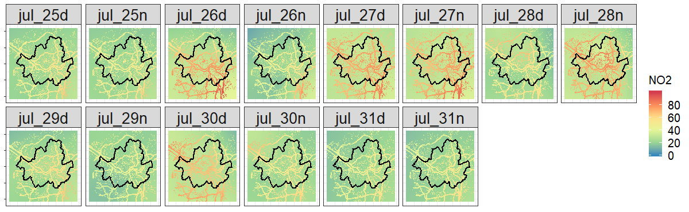      

### Winter

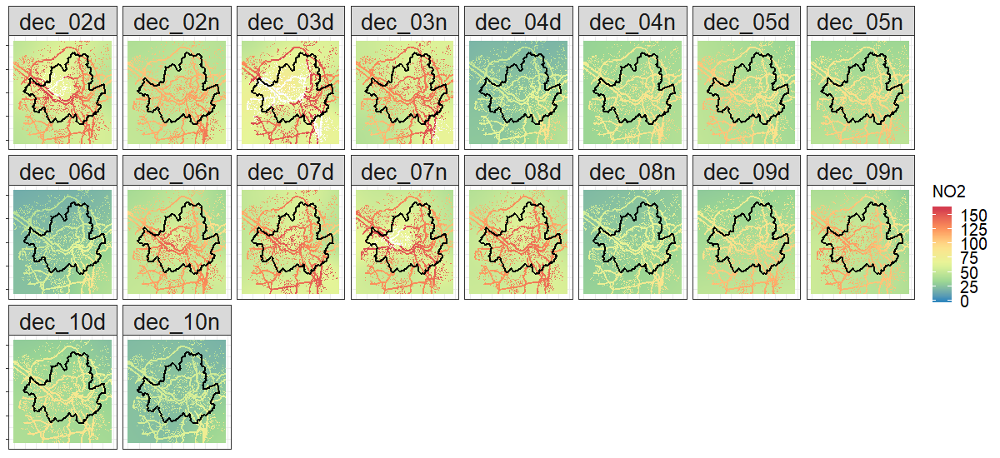
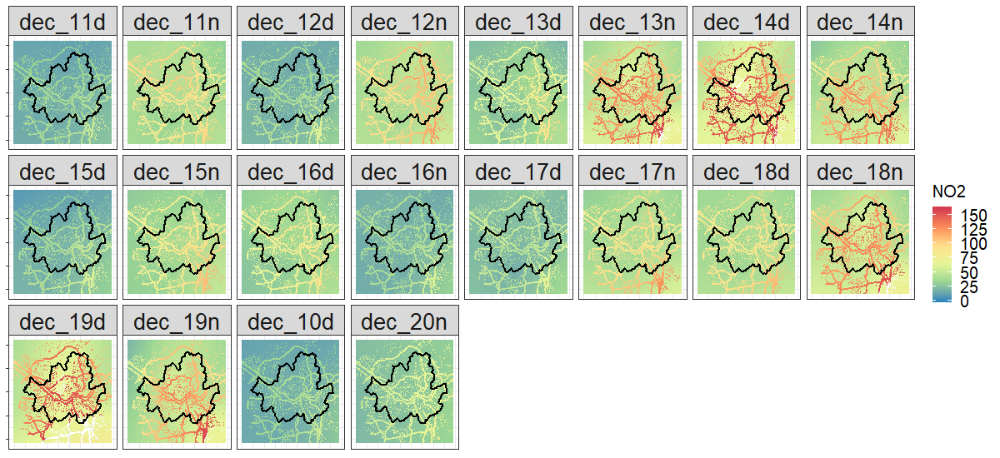
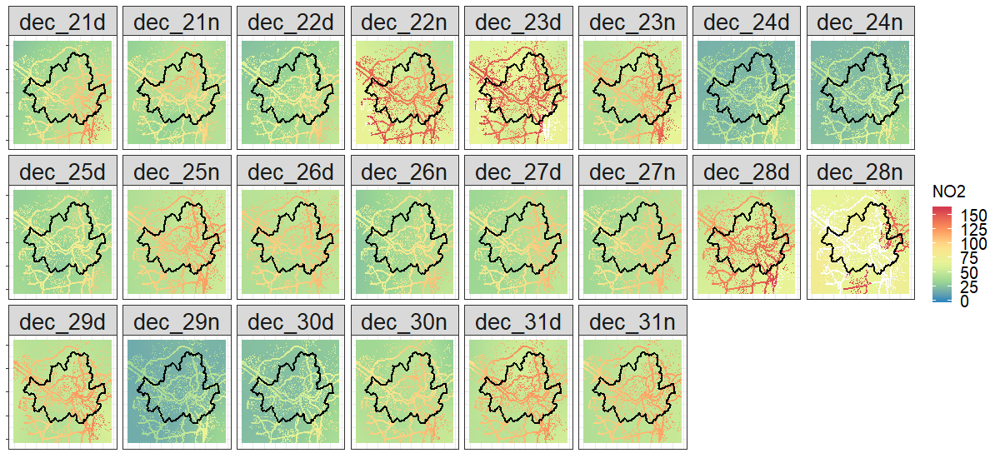
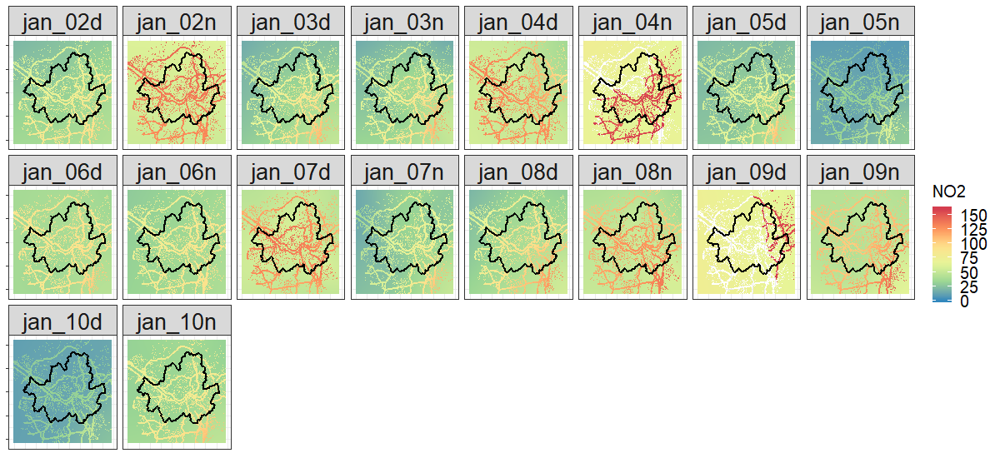

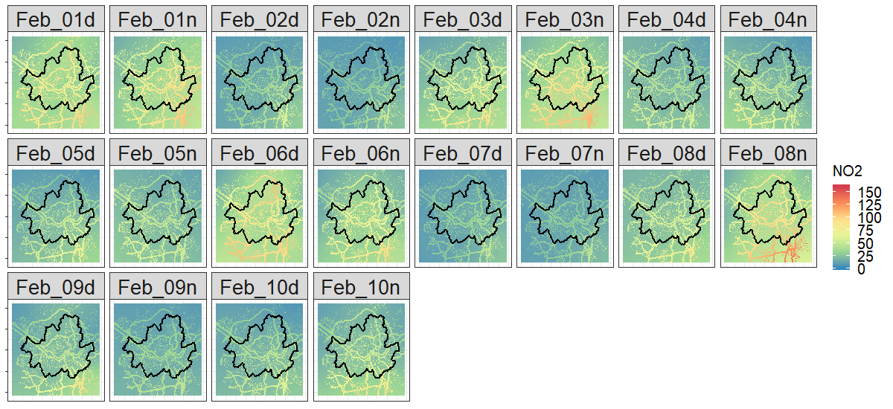
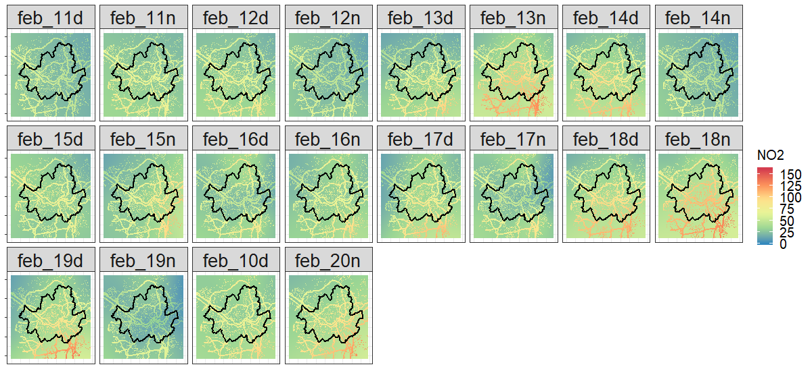
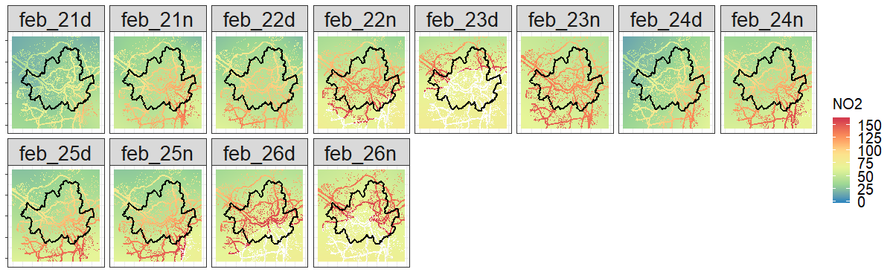

## GPS with Backpack sensors

  - How to aggregate houly gps records to a weekly reference point?

### Summer

      

### Winter

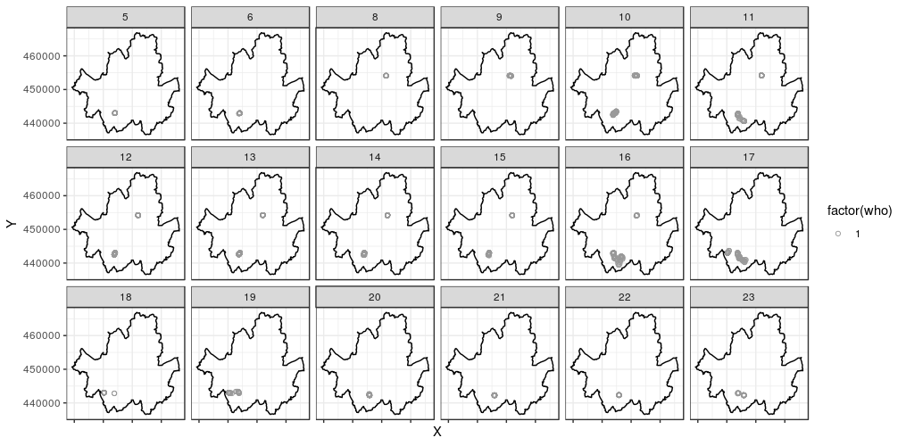
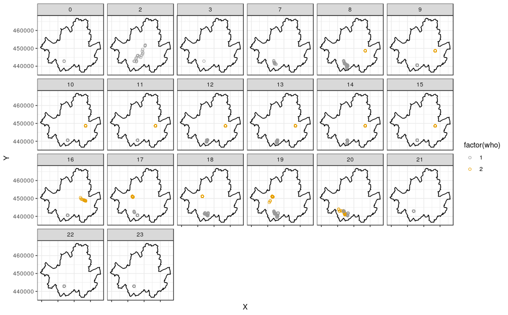
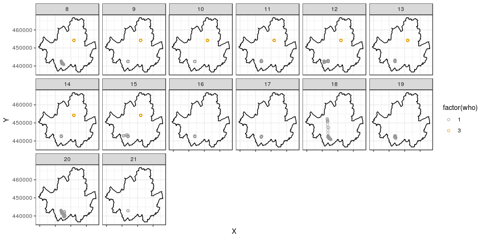
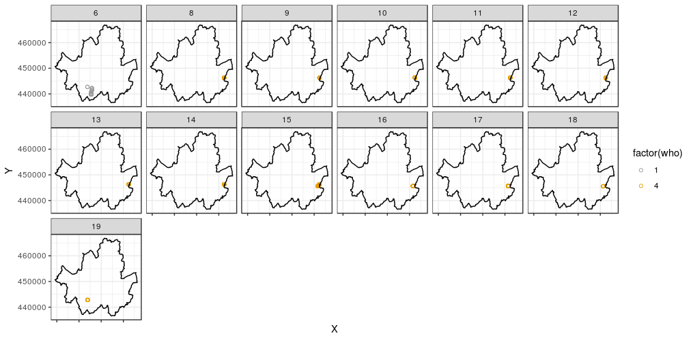
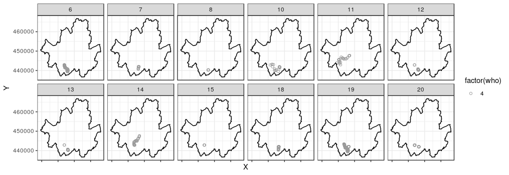
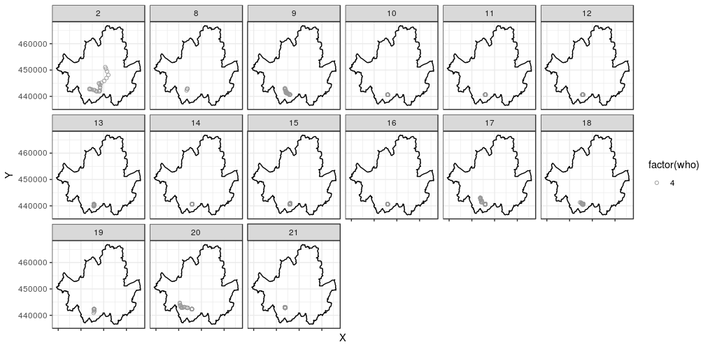
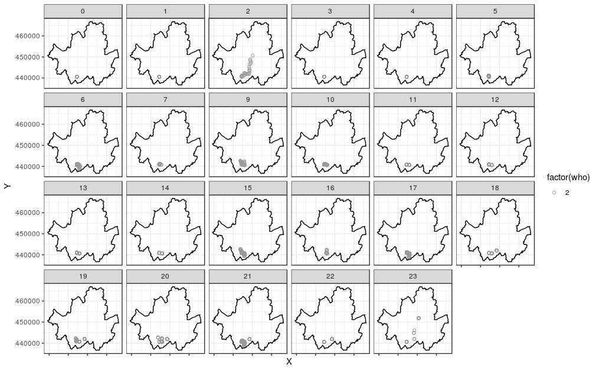
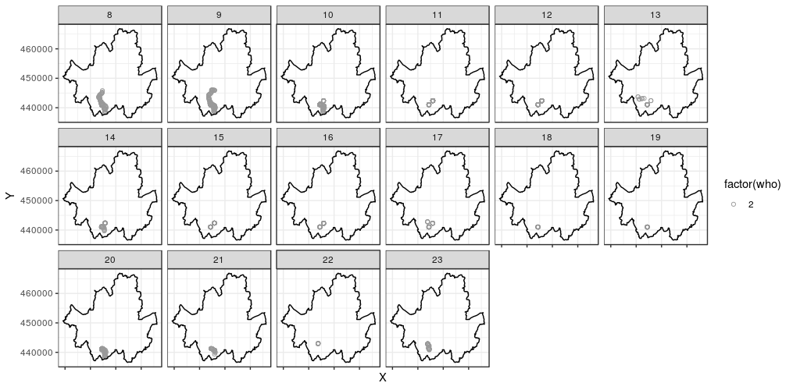
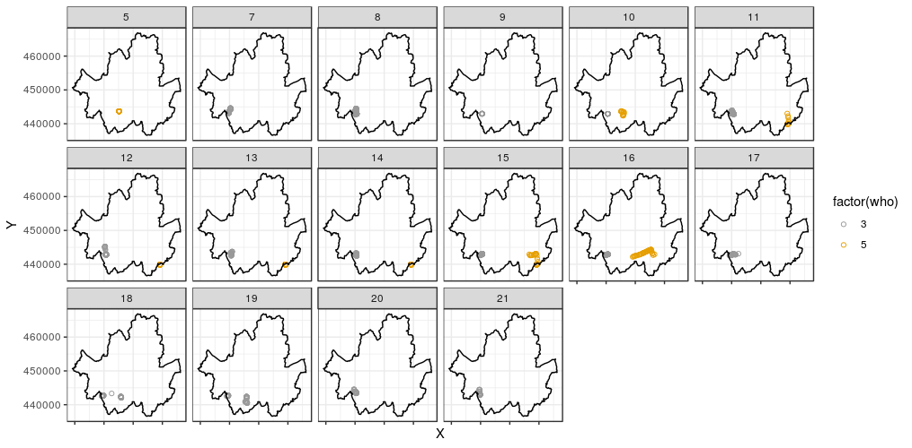
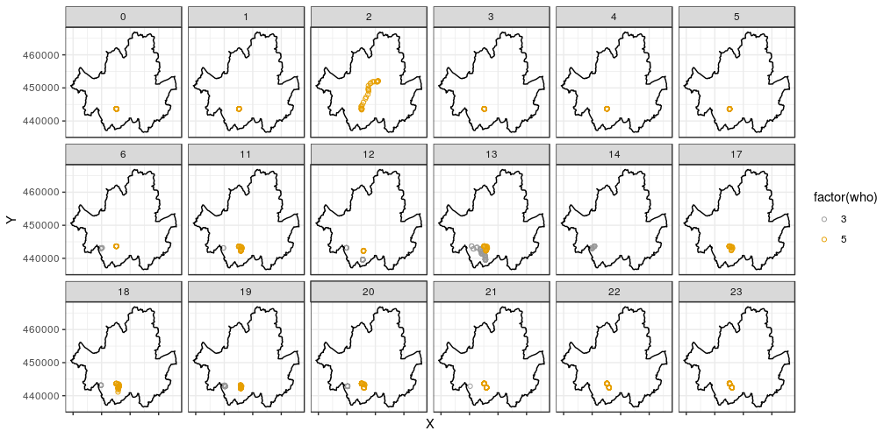
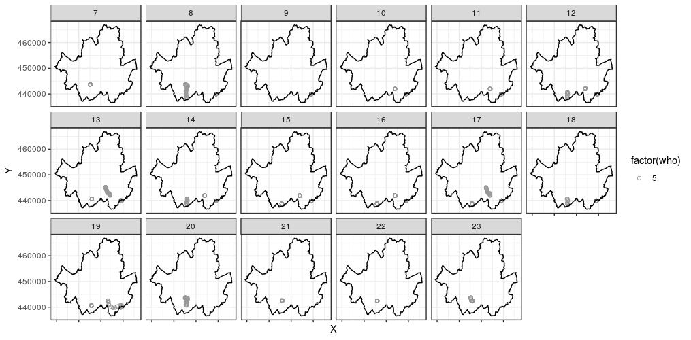
