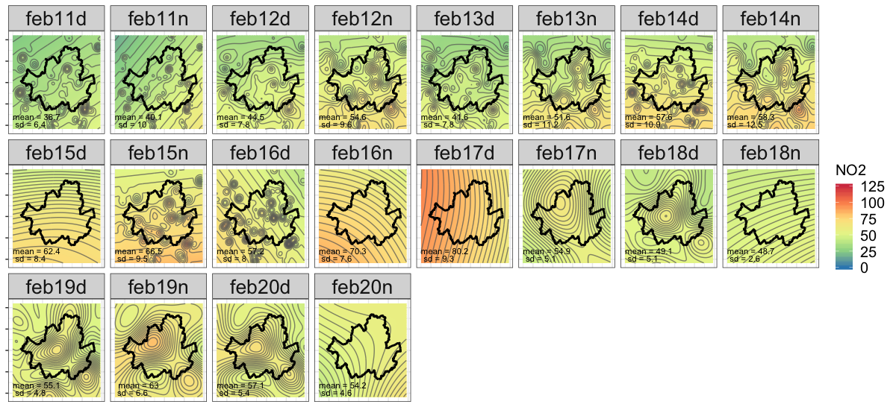
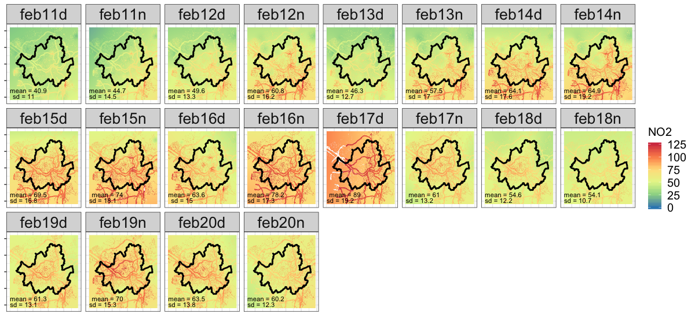

```{r setup, include=FALSE}
knitr::opts_chunk$set(echo = F)
```

## Brief Intro
I conducted a comparative analysis on two spatial interpolation methods, Universal kriging (UK) and generalised additive model (GAM), to observe any featured differences on the models and maps. I used hourly pollutants of NO<sub>2</sub>, PM<sub>10</sub>, and O<sub>3</sub> that were originally collected from 25 background and 15 roadside stations in Seoul, as well as some from surrounding areas to minimise boundary errors. Hourly data from each station were aggregated into a 12 hour mean with names given as home hours and office hours. X, Y, and elevation were used as predictors in both models. In terms of implementing multiple space-time kriging models, I automated the semi-variogram selection and parameterisation process to ease the hardship of daily variogram fitting.


## Kriging

### Outcome: February 11th-20th, 2014
Here are some examples from Kriging interpolation. You can see the entire results through this [link](https://github.com/mrsensible/GAM/tree/master/GAM_update_0430_files).

The kriged trends in mid-February show that the overall NO<sub>2</sub> starts off with 36.7µg/m<sup>3</sup>(sd±6.4) but continues to rise until it reaches 80.2µg/m<sup>3</sup>(sd±9.3) on the 17th, then decreases to 54.2 µg/m<sup>3</sup>(sd±4.6). It also shows small contours in some plots - called bull's eye effects' which means that the semivariogram couldn't find a similar value thus instead created a local value of its own, meaning *poor estimation*.



The figure below shows kriging interpolated map with road:nonroad ratio weight applied to roads. High pollution is seen either in urban highways or southern outskirts of the city.



### RMSE Kriging

Will compare RMSE results with GAM's outcome

```{r rmse, echo=F, warning=F, results='asis'}
rmse <- read.csv("GAM_update_0430_files/RMSE - Kriging.csv")
knitr::kable(rmse[1:10,], caption = "NO2 RMSE table")

```


<br><br>

## ~~GAM~~
### ~~Outcome~~
### ~~RMSE GAM~~

<br><br><br>

## Population
### 1. Small case study


* 5 Students in total
* Ignore travel modes
* Select a representative point
* Create a 1km ring buffer
* Measure 12 hour mean/max values inside the buffer

<br>
### 2. Census
To model the population-weighted exposure, two types of population - census, mobile LTE signal - will be tested. 


<br><br>
### ~~3. Mobile LTE signal~~


