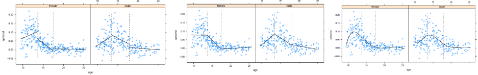
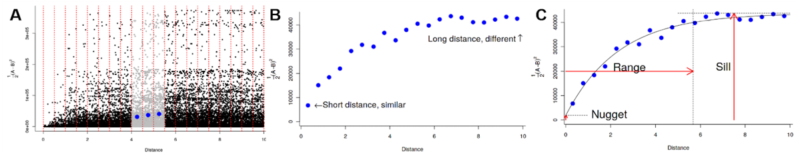
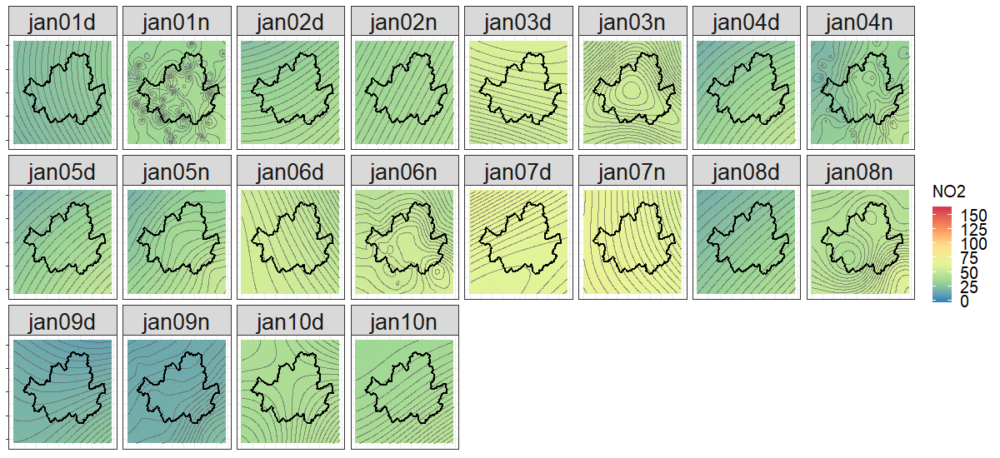
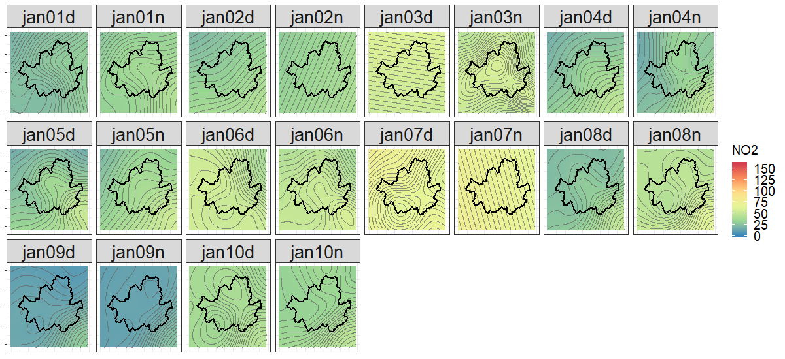
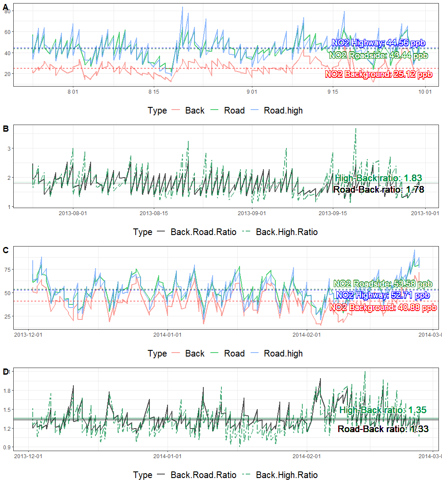
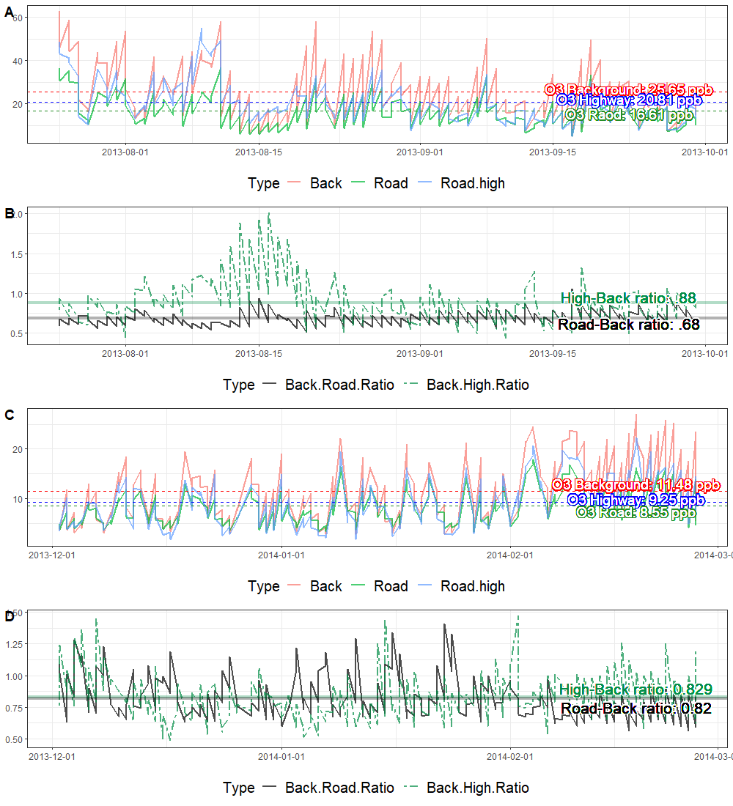
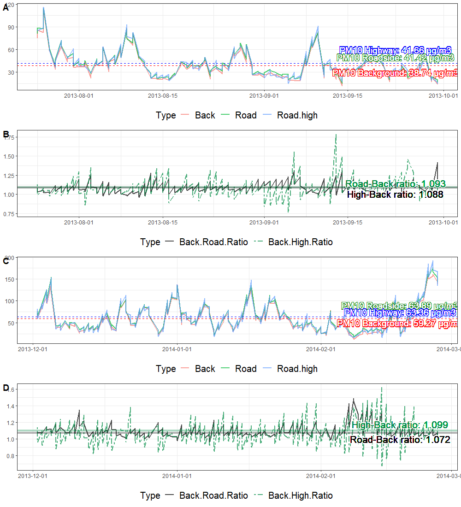
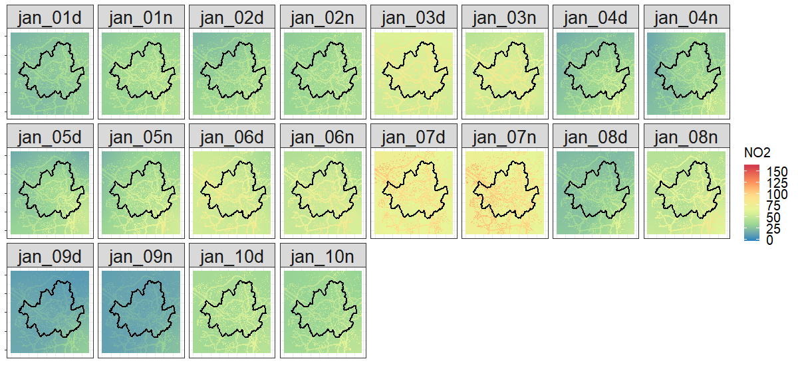
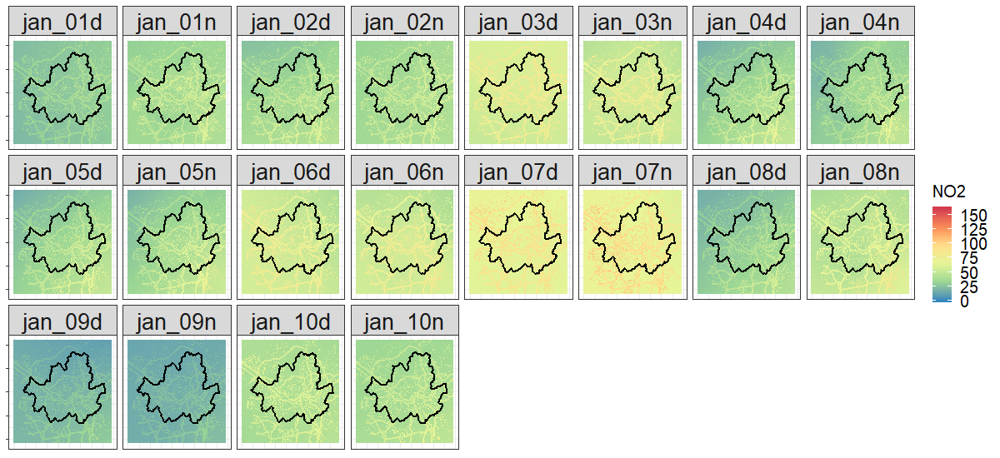

```{r setup, include=FALSE}
options(htmltools.dir.version = FALSE)
```

class: left, top

# Things to cover

#### Rationale

#### Kriging approach

#### GAM approach

#### Pros and Cons (from lit review)

#### Comparing results

---
class: inverse, center, middle

# Rationale

---
class: left, top

# Rationale

- Traditionally, spatial interpolation has been widely used to estimate pollution levels across surface areas

--

- The advantages were to get a broad sense of pollution estimation and get outputs with less calculation effort

--

- However, the statistical overfitting from variograms had over/under-estimated the outcomes that smoothed out the variance

--

- Nevertheless, it can still be worthwhile to model the results and compare them with the individual sensor data.


---
class: inverse, center, middle

# Method 1: Generalised Additive Models (GAMs)
---
class: left, top

# GAM: Concept

- GAM is a non-parametric extension of GLMs, and used when the modeller has no **a priori** hypothesis to select any parametric response functions (Borokini 2016, Wood 2017)

--

    - e.g. linear, logistic, or quadratic <- `whichever model suits`

--

$$g(E(Y))= α + s_1(x_1) + ... + s_p(x_p),$$

--

    - where Y is the dependent variable of index
    - E(Y) denotes the expected value, 
    - g( ) denotes the link function that links the expected value 
    - predictor variables x~1~, … x~p~

--

- Each predictor has a relationship with the dependent variable that can be indicated as a scatterplot

---
class: left, top

# GAM: Concept (cont.)

- **Penalised regression splines**: Once the dots are splitted to sections, the linkage between sections called *knots* are matched with polynomial functions (e.g. piecewise linear regression), then connects the untied points with smooth / link functions (e.g. loess, cyclic cubic, P-spline, tensor product) (Wood, 2017)

--

```{r piecewise, echo=FALSE, fig.show = 'hold', out.width = "60%", fig.align= "center", fig.cap = ""}

```

--

- Adding functions to knots to predict the link function is what we call an *additive* model.

- Model fitting is based on likelihood e.g. AIC, RMSE

---
class: left, top

# Advantages

- **Flexibility**: GAM is also known as a semi-parametric model as the assumptions are generous, and the relationships between response and predictors can find their best fit (Wood, 2017)

--

    - can be compared to OLS regression or GLMs that underlies strict parametric assumptions
    - useful when the relationship between the dependent and predictive variables are expected to be complex, and not easily fitted to a linear estimate

--

- **Additivity**: Categorical predictors are also able to be included in the model e.g. landcover types, gender.

--

- **Avoid overfitting**: Regularisation of predictor function helps avoid overfitting

---
class: left, top

# Disadvantages

--

-  **Weakness to overfitting**: Since the model has its elasticity of smoothness for model fitting, a modeller has to be conscious in controlling the wiggliness. 

--

    - Modellers should take into account two things when fitting a nonlinear model: close to data (avoiding underfitting), and not fitting the noise (avoid overfitting). 
    
--

    - Possible alternatives are to check whether the knots are too many or small by using `gam.check` or `qqgam` functions in R.

--

- **Slow execution speed**

--

---
class: left, top

# GAM: example plot


- Despite the difficulty of model interpretation and overfitting, it is preferred in spatial and temporal interpolation created with sophisticated smoothing methods. 

```{r gam2, echo=FALSE, fig.show = 'hold', out.width = "60%", fig.align= "center", fig.cap = "(A) shows black lines of predicted values, red dotted lines for -1 standard error, and green dotted lines for 1 standard error. (B) shows the observed and modelled relationship of residuals from DEM. Using the GAM approach, a series of interpolated PM<sub>10</sub> maps are shown in (C)."}
knitr::include_graphics("interpolation-methods_files/gam_ex.png")
```

---
class: inverse, center, middle

# Method 2: Kriging
---
class: left, top

# Kriging: Concept

--

- Kriging is a geostatistical interpolation method that predicts an estimate for an unmeasured location, given the characterized mean and variance structures.

--

- This method follows Tobler’s First Law of Geography: *Everything is related to everything else, but near things are more related than distant things*

    - by calculating the overall mean, distance, and variance of all observations.

--

$$\widehat{X}(s_{o}) = \sum_{i=1}^{N} \lambda_{i}Z(s_{i})$$

- Z(s<sub>i</sub>) = the measured value at the $i$th location
- $\lambda$<sub>i</sub> = an unknown weight for the measured value at the ith location
- s<sub>0</sub>$ = the prediction location
- *N* = the number of measured values

- The variance feature that represents spatial dependency is assessed by using a variogram

---
class: left, top

# Kriging: Concept(Cont.)

```{r kriging, echo=FALSE, fig.show = "asis", out.width = "100%", fig.align= "center", fig.cap= "Conceptual process of Kriging measurement"}

```

- A: Distance and the half-squared variances of all points. The dots are then filled into imaginary bins, and finally averaged to a single value. 

- B: A model of made from the blue dots. 

- C: Using three covariance parameters - range, partial sill, and nugget -, C creates a new covariance function. The range is the distance at which a spatial correlation exists. The partial sill and nugget parameters represent spatial and non-spatial variability, respectively.

---
class: left, top

# Kriging types

Once the variogram is confirmed, the interpolation can be modelled under different mathematical approaches.

- **Ordinary kriging** assumes a constant mean over space

- **Universal kriging** includes covariates in a regression framework to represent local variation

- Other approaches: **co-Kriging, block Kriging, simple Kriging**, and a mixture of either Kriging methods.


---
class: left, top

# Advantages

- Statistically proven analysis: **exploratory stat analysis -> semivariogram -> consider radius -> predict results**

- Explicit calculations for Semivariograms, and easy manipulation in model fitting: **choose semivariogram models, adjust range, nugget**

- *R specific* Small memory storage -> Appropriate for big data processes on local machine

---
class: left, top

# Disadvantages

- It does not consider various **built environments (e.g. roads, bridges, buildings, parks)** nor physical environments (e.g. mountains, weather) that cause a massive difference in our real world. 
    - Hoek (2017): > Kriging outcomes that only takes pollution fields into consideration can underestimate the spatial variation of locations that are further away from the stations.

--

- Max distance for local Kriging: if the max Dist isn't specified the local boundary will be considered as infinity `Maxdist = inf`, which slows down the modelling speed

--

- Randomness of Semivariogram model selection

--

- Smooths *out* the extremes during interpolation: even if the model is fitted, the smoothness of model may end up over/under-fitted, which in turn will have artifact results or have edge or bull's eye effects

---
class: inverse, center, middle

# Outcomes: Spatial Interpolation

---
class: top, left

# Outcome: Semivariogram - Codes

```
myList <- list()

for(i in 1:20) { 
  nam <- paste("Sem.Var", i, sep = "")
  myList[[length(myList)+1]] <- assign(nam, 
              autofitVariogram(no2.winter[[i+2]] ~ 1, 
              no2.winter))
}

rm(list=ls(pattern="Sem.Var"))

semvar <- lapply(myList, function(x) plot(x))
do.call(grid.arrange, semvar[1:4])
```

---
class: top, left

# Outcome: Semivariogram- Plots

```{r semi, echo=FALSE, fig.show = "asis", out.width = "70%", fig.align= "center", fig.cap= ""}
knitr::include_graphics("interpolation-methods_files/outcome_semivariogram.png")
```

---
class: top, left

# Outcome: Kriging

```{r out-kriging, echo=FALSE, fig.show = "asis", out.width = "100%", fig.align= "center", fig.cap= ""}

```

---
class: top, left

# Outcome: GAM

```{r out-GAM, echo=FALSE, fig.show = "asis", out.width = "100%", fig.align= "center", fig.cap= ""}

```

---
class: left, top

# Problems still remain...

- This section introduces a new approach of additional road effect that superimposes spatial interpolation outcomes. 

--

- Spatial interpolation itself contains variances and biases, particularly when temporal aggregation interval is short and monitoring stations are distant to each other 

    - e.g. Land Use Regression

--

- Even in the same study area, the signifance of predictor variables would differ to the previous year or it might not be selected 

    - e.g. Fluid dynamic models

---
class: top, left

# Solution: Applying Additional Road Effects on Spatial Interpolation Outputs

- Assuming that the pollution impacts are higher near roads, how can we apply additional road effects on top of spatial interpolations?

--

- With a spatially coarse, but temporarilly abundant data, can we do something *cool*?

--

- To overcome these limitations, an alternative appraoch is to measure **12 hour average of background stations and roadside stations**, **compare the ratio**, then **apply the ratio to road layouts**. 

---
class: inverse, center, middle

# Outcomes: Ratio Plots

---
class: top, left

## NO<sub>2</sub>: Dec.2013 - Feb.2014

```{r ratio-no2, echo=FALSE, fig.show = "asis", out.width = "70%", fig.align= "center", fig.cap= ""}

```

---
class: top, left

## O<sub>3</sub>: Dec.2013 - Feb.2014

```{r ratio-o3, echo=FALSE, fig.show = "asis", out.width = "70%", fig.align= "center", fig.cap= ""}

```

---
class: top, left

## PM<sub>10</sub>: Dec.2013 - Feb.2014

```{r ratio-pm10, echo=FALSE, fig.show = "asis", out.width = "70%", fig.align= "center", fig.cap= ""}

```


---
class: inverse, center, middle

# Add roads

```{r roads, echo=FALSE, fig.show = "asis", out.width = "100%", fig.align= "center", fig.cap= ""}

```

---
class: inverse, center, middle

# Outcomes: Final 

---
class: top, left

# Outcomes: GAM + Road ratio

```{r GAM-finale, echo=FALSE, fig.show = "asis", out.width = "100%", fig.align= "center", fig.cap= ""}

```

---
class: top, left

# Outcomes: Kriging + Road ratio

```{r Kriging-finale, echo=FALSE, fig.show = "asis", out.width = "100%", fig.align= "center", fig.cap= ""}

```

### Notice any difference?

---
class: inverse, center, middle

# Thank You