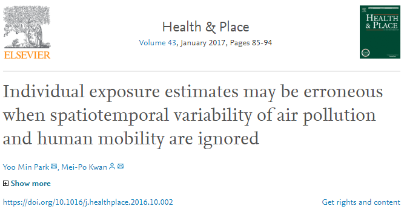

## Abstract

```{r abstract, echo=F}
knitr::include_graphics("pexposure/abstract.png")
```

```{r setup, include=FALSE}
options(htmltools.dir.version = FALSE)
library(tidyverse)
library(sf)
library(leaflet)
library(tmap)
library(tmaptools)
library(ggpmisc) # add peak points
library(plotly)

gps <- st_read("pexposure/real_original.shp")
seoul <- st_read("pexposure/seoul_gu.shp")
river <- st_read("pexposure/han_seoul.shp")
seoul_shp <- st_read("pexposure/seoul_gu.shp") %>% as('Spatial')
gps_df <- gps %>% dplyr::select(-time1)
gps_df$date <- as.Date(gps_df$time)
gps_df$datetime <- as.POSIXct(gps_df$time, format = "%Y-%m-%d %H:%M", tz = "Asia/Seoul") 
gps_df$hour <- lubridate::hour(gps_df$datetime)
gps_df$hour <- gps_df$hour + 1
gps_df$daynight <- ifelse(gps_df$hour >= 08 & gps_df$hour <= 19, "office", "home")

exposure_summer <- gps_df %>% filter(date >= "2013-07-25" & date <= "2013-09-30" & loc1 != 1, pm10 != 0) %>% arrange(datetime)
exposure_summer <- exposure_summer %>% 
                    mutate(loc1_1nm = case_when(loc1_1 == 10 ~ "Restaurant",
                                                loc1_1 == 11 ~ "Cafe",
                                                loc1_1 == 12 ~ "BBQ grill",
                                                loc1_1 == 13 ~ "Bar",
                                                loc1_1 == 14 ~ "Office",
                                                loc1_1 == 15 ~ "Traditional market",
                                                loc1_1 == 16 ~ "Superstore",
                                                loc1_1 == 17 ~ "Department store",
                                                loc1_1 == 18 ~ "Shopping complex",
                                                loc1_1 == 19 ~ "Other shops",
                                                loc1_1 == 20 ~ "Workplace",
                                                loc1_1 == 21 ~ "Bank",
                                                loc1_1 == 22 ~ "School",
                                                loc1_1 == 23 ~ "Academy",
                                                loc1_1 == 24 ~ "Bookshop",
                                                loc1_1 == 25 ~ "Senior centre",
                                                loc1_1 == 26 ~ "Stroll",
                                                loc1_1 == 27 ~ "Walking",
                                                loc1_1 == 28 ~ "Bus",
                                                loc1_1 == 29 ~ "Subway",
                                                loc1_1 == 30 ~ "Taxi",
                                                loc1_1 == 31 ~ "Vehicle",
                                                loc1_1 == 32 ~ "Home",
                                                loc1_1 == 999 ~ "Missing data"
                                                ))
```

<br><br><br>

## Rationale

```{r journal, echo=F}

```

- Ignoring the spatiotemporal variability of environmental risk factors and human mobility may lead to misleading results in exposure assessment (See [Yoo Min Park and Mei-Po Kwan](https://www.sciencedirect.com/science/article/pii/S1353829216304415))

> 
- **Where people live** is often not the only important factor in determining their exposure to environmental factors
- Rather, **where people visit** and **how much time they spend at** a particualr location are more relevant to assessing the effects of environmental factors on people's health behaviours or outcomes

<br><br><br>

## Personal measurement of PM<sub>10</sub> Exposures

* Location [Codes](https://github.com/mrsensible/GAM/blob/master/GAM_update_181223.md)
```{r codes, message=F, eval=F}
exposure_summer %>% 
    mutate(loc1_1nm = case_when(loc1_1 == 10 ~ "Restaurant",
            loc1_1 == 11 ~ "Cafe",
            loc1_1 == 12 ~ "BBQ grill",
            loc1_1 == 13 ~ "Bar",
            loc1_1 == 14 ~ "Office",
            loc1_1 == 15 ~ "Traditional market",
            loc1_1 == 16 ~ "Superstore",
            loc1_1 == 17 ~ "Department store",
            loc1_1 == 18 ~ "Shopping complex",
            loc1_1 == 19 ~ "Other shops",
            loc1_1 == 20 ~ "Workplace",
            loc1_1 == 21 ~ "Bank",
            loc1_1 == 22 ~ "School",
            loc1_1 == 23 ~ "Academy",
            loc1_1 == 24 ~ "Bookshop",
            loc1_1 == 25 ~ "Senior centre",
            loc1_1 == 26 ~ "Stroll",
            loc1_1 == 27 ~ "Walking",
            loc1_1 == 28 ~ "Bus",
            loc1_1 == 29 ~ "Subway",
            loc1_1 == 30 ~ "Taxi",
            loc1_1 == 31 ~ "Vehicle",
            loc1_1 == 32 ~ "Home",
            loc1_1 == 999 ~ "Missing data"
            ))
```

<br><br><br>

## Overview of Trajectories(Cont.)

* 16142 records of 5 individual backpack sensors measured by minutes

```{r overall, echo=F, message=F}
tmap_mode("view")
tm_shape(seoul) +
  tm_borders() +
tm_shape(exposure_summer) + 
  tm_dots("pm10", breaks = c(0, 25, 50, 75, 100), id = "loc1_1", title = "PM10 summer")

```

<br><br><br>

## Clusters of footprints
- Points are the footprints for each researcher
- The ellipsoid represents the 95% confidence of the distribution of points on the map
- The footprint of researchers are centered in Gwanak district, particularly situated in the University Campus.

```{r places2, echo=F, message=F, warning=F}
outside <- gps_df %>% filter(date >= "2013-07-25" & date <= "2013-09-30" & loc1 != 1 & pm10 != 0 & pm10 < 150 & loc1_1 != 14 & loc1_1 != 28 & loc1_1 != 29 & loc1_1 != 30)  %>% arrange(datetime) 

outside %>% 
  ggplot() +
  geom_point(aes(x = X, y = Y, colour = pm10), shape = 21, size = 2) +
  scale_color_gradientn(colors = c("#00AFBB", "#E7B800", "#FC4E07")) +
  stat_ellipse(data = outside, aes(X, Y)) +
  facet_wrap(~who, ncol = 5) +
  xlim(179171, 216221) + 
  ylim(436569, 466856) +
  geom_sf(data = seoul, colour="grey", fill=NA) + 
  theme_bw() +
  theme(axis.text.x = element_blank())
```

<br><br><br>

## Exposure levels by researchers


```{r byresearcher, echo=F, warning=F, message=F}
library(OpenStreetMap)
exposure_summer %>% filter(pm10 >= 200 & loc1_1 != 999) -> high

gwanak <- seoul[seoul$SIGUNGU_CD == 11210,]
exposure_gw <- crop_shape(high, gwanak, polygon = TRUE)
gwanak_osm <- read_osm(gwanak, type = "osm", zoom = 14)
tmap_mode("plot")
qtm(gwanak_osm) +
  qtm(exposure_gw, dots.size = 0.2)#, by = "who")

```

<br><br>

```{r byresearcher1, echo=F, warning=F, message=F}
library(ggpmisc) # add peak points
exposure_summer %>% 
  ggplot(aes(date, y = pm10)) +
  geom_line(aes(colour = factor(who)), size = 1) +
  stat_peaks(colour = "grey40", alpha = .15) +
  ylim(0,500) +
  facet_wrap(~ who, ncol = 1, strip.position="right") +
  theme_minimal()
```

<br><br><br>

## Highly polluted areas?

```{r highpolluted, echo=F, warning=F, message=F}
exposure_summer %>% filter(pm10 >= 200 & loc1_1 != 999) -> high

high %>% 
  ggplot(aes(x = factor(loc1_1nm), fill = factor(loc1_1nm))) + 
  geom_bar(stat="count", color="black") +
  coord_flip() +
  scale_x_discrete(limits = rev(levels(factor(high$loc1_1nm)))) +
  ggtitle(label = "Places of PM10 concentrations over 200µg/m3: Counts by minutes",
          subtitle = "Records of 419 Observations") +
  xlab("Counts by minutes") +
  theme_minimal() +
  theme(axis.text.x = element_text(angle = 90, hjust = 1),
  axis.ticks.x=element_blank(),
  axis.title.y=element_blank(),
  strip.text.x = element_text(size = 20),
  legend.position = "none"
  )
```

<br><br>

```{r highstats, echo=F, warning=F, message=F}
highstats <- exposure_summer %>% 
  st_set_geometry(NULL) %>% 
  group_by(loc1_1, loc1_1nm) %>% 
  summarise(mean_pm10 = round(mean(pm10),2),
            sd_pm10 = round(sd(pm10),2),
            min_pm10 =min(pm10),
            max_pm10 = max(pm10), 
            count = length(pm10)
            ) #%>% print(n = 22)

knitr::kable(highstats)
```

<br><br><br>

## PM<sub>10</sub> Exposure by Transport Modes

```{r transport, echo=F, warning=F, message=F}
trans_model <- exposure_summer %>% 
    st_set_geometry(NULL) %>% 
    filter(loc1_1 %in% c(26:31))


p <- trans_model %>% 
  ggplot(aes(x = loc1_1nm, y = pm10)) +
  geom_violin(aes(fill = loc1_1nm), trim = T) +
  stat_summary(fun.y=median, geom="point", shape=23, size=2) +
  geom_boxplot(width=0.1, outlier.shape = NA) +
  ylim(0,500) +
  scale_fill_brewer(palette="RdBu") +
  theme_minimal() +
  theme(legend.position="none",
        axis.title.x = element_blank()
  )
ggplotly(p)
```

<br><br><br>

## (Near) Future works
- Use *walking* and *strolling* info to compare modelled outcome
- Consider time scale from minutes to 12 hour aggregation
```{r future, echo=FALSE, message=F, fig.show = 'hold', out.width = "100%", fig.align= "center", fig.cap = ""}
knitr::include_graphics("pexposure/12hourmean.png")
```
