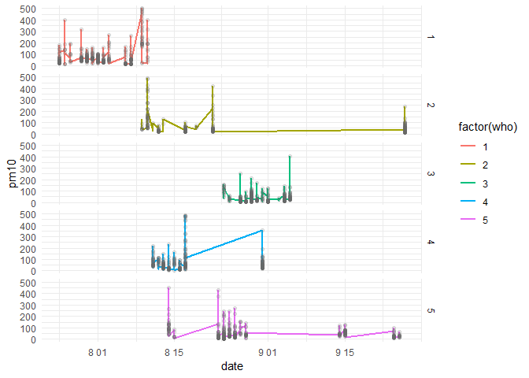

How can we compare a Modelled outcome with a Personal Measurement
outcome?
================
Hyesop Shin
2019-05-18

## Abstract

<!-- -->

<br><br><br>

## Rationale

<!-- -->

  - Ignoring the spatiotemporal variability of environmental risk
    factors and human mobility may lead to misleading results in
    exposure assessment (See [Yoo Min Park and Mei-Po
    Kwan](https://www.sciencedirect.com/science/article/pii/S1353829216304415))
    \>
  - **Where people live** is often not the only important factor in
    determining their exposure to environmental factors
  - Rather, **where people visit** and **how much time they spend at** a
    particualr location are more relevant to assessing the effects of
    environmental factors on people’s health behaviours or outcomes

<br><br><br>

## Personal measurement of PM<sub>10</sub> Exposures

  - Location
    [Codes](https://github.com/mrsensible/GAM/blob/master/GAM_update_181223.md)

<!-- end list -->

``` r
exposure_summer %>% 
    mutate(loc1_1nm = case_when(loc1_1 == 10 ~ "Restaurant",
            loc1_1 == 11 ~ "Cafe",
            loc1_1 == 12 ~ "BBQ grill",
            loc1_1 == 13 ~ "Bar",
            loc1_1 == 14 ~ "Office",
            loc1_1 == 15 ~ "Traditional market",
            loc1_1 == 16 ~ "Superstore",
            loc1_1 == 17 ~ "Department store",
            loc1_1 == 18 ~ "Shopping complex",
            loc1_1 == 19 ~ "Other shops",
            loc1_1 == 20 ~ "Workplace",
            loc1_1 == 21 ~ "Bank",
            loc1_1 == 22 ~ "School",
            loc1_1 == 23 ~ "Academy",
            loc1_1 == 24 ~ "Bookshop",
            loc1_1 == 25 ~ "Senior centre",
            loc1_1 == 26 ~ "Stroll",
            loc1_1 == 27 ~ "Walking",
            loc1_1 == 28 ~ "Bus",
            loc1_1 == 29 ~ "Subway",
            loc1_1 == 30 ~ "Taxi",
            loc1_1 == 31 ~ "Vehicle",
            loc1_1 == 32 ~ "Home",
            loc1_1 == 999 ~ "Missing data"
            ))
```

<br><br><br>

## Overview of Trajectories(Cont.)

  - 16142 records of 5 individual backpack sensors measured by minutes

<!-- -->

<br><br><br>

## Clusters of footprints

  - Points are the footprints for each researcher
  - The ellipsoid represents the 95% confidence of the distribution of
    points on the map
  - The footprint of researchers are centered in Gwanak district,
    particularly situated in the University
Campus.

<!-- -->

<br><br><br>

## Exposure levels by researchers

<!-- -->

<br><br>

<!-- -->

<br><br><br>

## Polluted area

<!-- -->

<br><br><br>

## Highly polluted areas?

| loc1\_1 | loc1\_1nm          | mean\_pm10 | sd\_pm10 | min\_pm10 | max\_pm10 | count |
| ------: | :----------------- | ---------: | -------: | --------: | --------: | ----: |
|      10 | Restaurant         |      53.59 |    41.30 |       9.7 |     270.4 |   713 |
|      11 | Cafe               |      35.31 |    15.14 |      14.7 |      98.3 |   184 |
|      12 | BBQ grill          |     259.02 |   276.20 |      24.3 |    1170.3 |   295 |
|      13 | Bar                |     124.69 |   114.32 |      20.3 |     771.5 |  1178 |
|      14 | Office             |      22.83 |    15.93 |       4.5 |     147.2 |  5397 |
|      15 | Traditional market |      76.64 |    30.84 |      25.4 |     152.2 |    60 |
|      16 | Superstore         |      70.39 |    35.34 |      22.7 |     136.9 |    10 |
|      18 | Shopping complex   |     112.53 |    75.63 |      27.1 |     320.4 |    14 |
|      19 | Other shops        |      37.33 |    13.69 |      16.2 |     172.0 |  1771 |
|      20 | Workplace          |      36.45 |    19.95 |       5.2 |     113.6 |   713 |
|      21 | Bank               |      26.69 |    15.68 |      14.4 |      91.9 |    41 |
|      22 | School             |      37.04 |    21.25 |       2.4 |     239.9 |   880 |
|      23 | Academy            |      11.09 |     5.20 |       4.8 |      46.7 |   254 |
|      24 | Bookshop           |      86.90 |       NA |      86.9 |      86.9 |     1 |
|      25 | Senior centre      |      22.18 |    37.04 |       4.9 |     799.5 |   954 |
|      26 | Stroll             |      43.72 |    37.09 |      12.7 |     265.0 |   259 |
|      27 | Walking            |      62.85 |    61.09 |       1.0 |     954.1 |  1365 |
|      28 | Bus                |      37.64 |    90.66 |       3.5 |    2565.9 |   860 |
|      29 | Subway             |      32.18 |    21.46 |       8.3 |     112.7 |   118 |
|      30 | Taxi               |      45.21 |    67.63 |       1.1 |     581.0 |   373 |
|      31 | Vehicle            |      36.92 |    40.21 |       8.6 |     802.1 |   645 |
|     999 | Missing data       |      63.15 |    47.10 |       7.2 |     402.0 |   394 |

<br><br><br>

## PM<sub>10</sub> Exposure by Transport Modes

<!-- -->

<br><br><br>

## (Near) Future works

  - Use *walking* and *strolling* info to compare modelled outcome
  - Consider time scale from minutes to 12 hour aggregation
    
