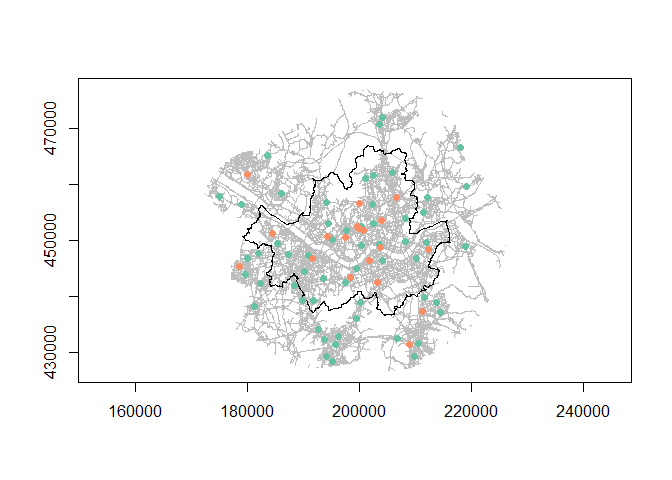

Distance between Seoul Stations
================

## Stations

<table class="table table-striped" style="width: auto !important; margin-left: auto; margin-right: auto;">

<caption>

Group Rows

</caption>

<thead>

<tr>

<th style="text-align:right;">

Long

</th>

<th style="text-align:right;">

Lat

</th>

<th style="text-align:left;">

Province

</th>

<th style="text-align:left;">

City

</th>

<th style="text-align:left;">

Name

</th>

<th style="text-align:left;">

F.R

</th>

<th style="text-align:right;">

DEM

</th>

</tr>

</thead>

<tbody>

<tr grouplength="57">

<td colspan="7" style="border-bottom: 1px solid;">

<strong>Background Stations</strong>

</td>

</tr>

<tr>

<td style="text-align:right; padding-left: 2em;" indentlevel="1">

126.9745

</td>

<td style="text-align:right;">

37.56423

</td>

<td style="text-align:left;">

Seoul

</td>

<td style="text-align:left;">

Seoul

</td>

<td style="text-align:left;">

Jung-gu

</td>

<td style="text-align:left;">

Fixed

</td>

<td style="text-align:right;">

44.174211

</td>

</tr>

<tr>

<td style="text-align:right; padding-left: 2em;" indentlevel="1">

127.0050

</td>

<td style="text-align:right;">

37.57201

</td>

<td style="text-align:left;">

Seoul

</td>

<td style="text-align:left;">

Seoul

</td>

<td style="text-align:left;">

Jongno-gu

</td>

<td style="text-align:left;">

Fixed

</td>

<td style="text-align:right;">

27.906591

</td>

</tr>

<tr>

<td style="text-align:right; padding-left: 2em;" indentlevel="1">

127.0048

</td>

<td style="text-align:right;">

37.54005

</td>

<td style="text-align:left;">

Seoul

</td>

<td style="text-align:left;">

Seoul

</td>

<td style="text-align:left;">

Yongsan-gu

</td>

<td style="text-align:left;">

Fixed

</td>

<td style="text-align:right;">

47.391379

</td>

</tr>

<tr>

<td style="text-align:right; padding-left: 2em;" indentlevel="1">

127.0929

</td>

<td style="text-align:right;">

37.54726

</td>

<td style="text-align:left;">

Seoul

</td>

<td style="text-align:left;">

Seoul

</td>

<td style="text-align:left;">

Gwangjin-gu

</td>

<td style="text-align:left;">

Fixed

</td>

<td style="text-align:right;">

44.971884

</td>

</tr>

<tr>

<td style="text-align:right; padding-left: 2em;" indentlevel="1">

127.0418

</td>

<td style="text-align:right;">

37.54304

</td>

<td style="text-align:left;">

Seoul

</td>

<td style="text-align:left;">

Seoul

</td>

<td style="text-align:left;">

Seongdong-gu

</td>

<td style="text-align:left;">

Fixed

</td>

<td style="text-align:right;">

15.553431

</td>

</tr>

<tr>

<td style="text-align:right; padding-left: 2em;" indentlevel="1">

127.0940

</td>

<td style="text-align:right;">

37.58488

</td>

<td style="text-align:left;">

Seoul

</td>

<td style="text-align:left;">

Seoul

</td>

<td style="text-align:left;">

Jungnang-gu

</td>

<td style="text-align:left;">

Fixed

</td>

<td style="text-align:right;">

43.760231

</td>

</tr>

<tr>

<td style="text-align:right; padding-left: 2em;" indentlevel="1">

127.0288

</td>

<td style="text-align:right;">

37.57585

</td>

<td style="text-align:left;">

Seoul

</td>

<td style="text-align:left;">

Seoul

</td>

<td style="text-align:left;">

Dongdaemun-gu

</td>

<td style="text-align:left;">

Fixed

</td>

<td style="text-align:right;">

21.461333

</td>

</tr>

<tr>

<td style="text-align:right; padding-left: 2em;" indentlevel="1">

127.0273

</td>

<td style="text-align:right;">

37.60671

</td>

<td style="text-align:left;">

Seoul

</td>

<td style="text-align:left;">

Seoul

</td>

<td style="text-align:left;">

Seongbuk-gu

</td>

<td style="text-align:left;">

Fixed

</td>

<td style="text-align:right;">

43.060676

</td>

</tr>

<tr>

<td style="text-align:right; padding-left: 2em;" indentlevel="1">

127.0291

</td>

<td style="text-align:right;">

37.65416

</td>

<td style="text-align:left;">

Seoul

</td>

<td style="text-align:left;">

Seoul

</td>

<td style="text-align:left;">

Dobong-gu

</td>

<td style="text-align:left;">

Fixed

</td>

<td style="text-align:right;">

66.457969

</td>

</tr>

<tr>

<td style="text-align:right; padding-left: 2em;" indentlevel="1">

126.9331

</td>

<td style="text-align:right;">

37.61013

</td>

<td style="text-align:left;">

Seoul

</td>

<td style="text-align:left;">

Seoul

</td>

<td style="text-align:left;">

Eunpyeong-gu

</td>

<td style="text-align:left;">

Fixed

</td>

<td style="text-align:right;">

44.942140

</td>

</tr>

<tr>

<td style="text-align:right; padding-left: 2em;" indentlevel="1">

126.9378

</td>

<td style="text-align:right;">

37.57671

</td>

<td style="text-align:left;">

Seoul

</td>

<td style="text-align:left;">

Seoul

</td>

<td style="text-align:left;">

Seodaemun-gu

</td>

<td style="text-align:left;">

Fixed

</td>

<td style="text-align:right;">

85.367518

</td>

</tr>

<tr>

<td style="text-align:right; padding-left: 2em;" indentlevel="1">

126.9455

</td>

<td style="text-align:right;">

37.54986

</td>

<td style="text-align:left;">

Seoul

</td>

<td style="text-align:left;">

Seoul

</td>

<td style="text-align:left;">

Mapo-gu

</td>

<td style="text-align:left;">

Fixed

</td>

<td style="text-align:right;">

22.694456

</td>

</tr>

<tr>

<td style="text-align:right; padding-left: 2em;" indentlevel="1">

126.8352

</td>

<td style="text-align:right;">

37.54465

</td>

<td style="text-align:left;">

Seoul

</td>

<td style="text-align:left;">

Seoul

</td>

<td style="text-align:left;">

Gangseo-gu

</td>

<td style="text-align:left;">

Fixed

</td>

<td style="text-align:right;">

22.150375

</td>

</tr>

<tr>

<td style="text-align:right; padding-left: 2em;" indentlevel="1">

126.8897

</td>

<td style="text-align:right;">

37.49854

</td>

<td style="text-align:left;">

Seoul

</td>

<td style="text-align:left;">

Seoul

</td>

<td style="text-align:left;">

Guro-gu

</td>

<td style="text-align:left;">

Fixed

</td>

<td style="text-align:right;">

18.683859

</td>

</tr>

<tr>

<td style="text-align:right; padding-left: 2em;" indentlevel="1">

126.8974

</td>

<td style="text-align:right;">

37.52492

</td>

<td style="text-align:left;">

Seoul

</td>

<td style="text-align:left;">

Seoul

</td>

<td style="text-align:left;">

Yeongdeungpo-gu

</td>

<td style="text-align:left;">

Fixed

</td>

<td style="text-align:right;">

20.620782

</td>

</tr>

<tr>

<td style="text-align:right; padding-left: 2em;" indentlevel="1">

126.9716

</td>

<td style="text-align:right;">

37.48095

</td>

<td style="text-align:left;">

Seoul

</td>

<td style="text-align:left;">

Seoul

</td>

<td style="text-align:left;">

Dongjak-gu

</td>

<td style="text-align:left;">

Fixed

</td>

<td style="text-align:right;">

32.164203

</td>

</tr>

<tr>

<td style="text-align:right; padding-left: 2em;" indentlevel="1">

126.9271

</td>

<td style="text-align:right;">

37.48734

</td>

<td style="text-align:left;">

Seoul

</td>

<td style="text-align:left;">

Seoul

</td>

<td style="text-align:left;">

Gwanak-gu

</td>

<td style="text-align:left;">

Fixed

</td>

<td style="text-align:right;">

27.533197

</td>

</tr>

<tr>

<td style="text-align:right; padding-left: 2em;" indentlevel="1">

127.0476

</td>

<td style="text-align:right;">

37.51749

</td>

<td style="text-align:left;">

Seoul

</td>

<td style="text-align:left;">

Seoul

</td>

<td style="text-align:left;">

Gangnam-gu

</td>

<td style="text-align:left;">

Fixed

</td>

<td style="text-align:right;">

43.735886

</td>

</tr>

<tr>

<td style="text-align:right; padding-left: 2em;" indentlevel="1">

126.9944

</td>

<td style="text-align:right;">

37.50454

</td>

<td style="text-align:left;">

Seoul

</td>

<td style="text-align:left;">

Seoul

</td>

<td style="text-align:left;">

Seocho-gu

</td>

<td style="text-align:left;">

Fixed

</td>

<td style="text-align:right;">

17.660091

</td>

</tr>

<tr>

<td style="text-align:right; padding-left: 2em;" indentlevel="1">

127.1154

</td>

<td style="text-align:right;">

37.52032

</td>

<td style="text-align:left;">

Seoul

</td>

<td style="text-align:left;">

Seoul

</td>

<td style="text-align:left;">

Songpa-gu

</td>

<td style="text-align:left;">

Fixed

</td>

<td style="text-align:right;">

31.292333

</td>

</tr>

<tr>

<td style="text-align:right; padding-left: 2em;" indentlevel="1">

127.1368

</td>

<td style="text-align:right;">

37.54501

</td>

<td style="text-align:left;">

Seoul

</td>

<td style="text-align:left;">

Seoul

</td>

<td style="text-align:left;">

Gangdong-gu

</td>

<td style="text-align:left;">

Fixed

</td>

<td style="text-align:right;">

36.980996

</td>

</tr>

<tr>

<td style="text-align:right; padding-left: 2em;" indentlevel="1">

126.9083

</td>

<td style="text-align:right;">

37.45240

</td>

<td style="text-align:left;">

Seoul

</td>

<td style="text-align:left;">

Seoul

</td>

<td style="text-align:left;">

Geumcheon-gu

</td>

<td style="text-align:left;">

Fixed

</td>

<td style="text-align:right;">

30.487869

</td>

</tr>

<tr>

<td style="text-align:right; padding-left: 2em;" indentlevel="1">

127.0118

</td>

<td style="text-align:right;">

37.64787

</td>

<td style="text-align:left;">

Seoul

</td>

<td style="text-align:left;">

Seoul

</td>

<td style="text-align:left;">

Gangbuk-gu

</td>

<td style="text-align:left;">

Fixed

</td>

<td style="text-align:right;">

50.610697

</td>

</tr>

<tr>

<td style="text-align:right; padding-left: 2em;" indentlevel="1">

126.8566

</td>

<td style="text-align:right;">

37.52593

</td>

<td style="text-align:left;">

Seoul

</td>

<td style="text-align:left;">

Seoul

</td>

<td style="text-align:left;">

Yangcheon-gu

</td>

<td style="text-align:left;">

Fixed

</td>

<td style="text-align:right;">

17.448380

</td>

</tr>

<tr>

<td style="text-align:right; padding-left: 2em;" indentlevel="1">

127.0679

</td>

<td style="text-align:right;">

37.65749

</td>

<td style="text-align:left;">

Seoul

</td>

<td style="text-align:left;">

Seoul

</td>

<td style="text-align:left;">

Nowon-gu

</td>

<td style="text-align:left;">

Fixed

</td>

<td style="text-align:right;">

34.646792

</td>

</tr>

<tr>

<td style="text-align:right; padding-left: 2em;" indentlevel="1">

127.1555

</td>

<td style="text-align:right;">

37.44932

</td>

<td style="text-align:left;">

Gyeonggyi

</td>

<td style="text-align:left;">

Seongnam

</td>

<td style="text-align:left;">

Dandae

</td>

<td style="text-align:left;">

Fixed

</td>

<td style="text-align:right;">

85.022232

</td>

</tr>

<tr>

<td style="text-align:right; padding-left: 2em;" indentlevel="1">

127.1115

</td>

<td style="text-align:right;">

37.36143

</td>

<td style="text-align:left;">

Gyeonggyi

</td>

<td style="text-align:left;">

Seongnam

</td>

<td style="text-align:left;">

Jungja

</td>

<td style="text-align:left;">

Fixed

</td>

<td style="text-align:right;">

58.624472

</td>

</tr>

<tr>

<td style="text-align:right; padding-left: 2em;" indentlevel="1">

127.1191

</td>

<td style="text-align:right;">

37.38263

</td>

<td style="text-align:left;">

Gyeonggyi

</td>

<td style="text-align:left;">

Seongnam

</td>

<td style="text-align:left;">

Sunae

</td>

<td style="text-align:left;">

Fixed

</td>

<td style="text-align:right;">

43.407718

</td>

</tr>

<tr>

<td style="text-align:right; padding-left: 2em;" indentlevel="1">

127.1311

</td>

<td style="text-align:right;">

37.45706

</td>

<td style="text-align:left;">

Gyeonggyi

</td>

<td style="text-align:left;">

Seongnam

</td>

<td style="text-align:left;">

Bokjeong

</td>

<td style="text-align:left;">

Fixed

</td>

<td style="text-align:right;">

49.107466

</td>

</tr>

<tr>

<td style="text-align:right; padding-left: 2em;" indentlevel="1">

127.0779

</td>

<td style="text-align:right;">

37.39050

</td>

<td style="text-align:left;">

Gyeonggyi

</td>

<td style="text-align:left;">

Seongnam

</td>

<td style="text-align:left;">

Unjung

</td>

<td style="text-align:left;">

Fixed

</td>

<td style="text-align:right;">

73.739301

</td>

</tr>

<tr>

<td style="text-align:right; padding-left: 2em;" indentlevel="1">

127.1643

</td>

<td style="text-align:right;">

37.43316

</td>

<td style="text-align:left;">

Gyeonggyi

</td>

<td style="text-align:left;">

Seongnam

</td>

<td style="text-align:left;">

Sangdaewon

</td>

<td style="text-align:left;">

Fixed

</td>

<td style="text-align:right;">

73.618131

</td>

</tr>

<tr>

<td style="text-align:right; padding-left: 2em;" indentlevel="1">

127.0404

</td>

<td style="text-align:right;">

37.73559

</td>

<td style="text-align:left;">

Gyeonggyi

</td>

<td style="text-align:left;">

Uijeongbu

</td>

<td style="text-align:left;">

Uijeongbu

</td>

<td style="text-align:left;">

Fixed

</td>

<td style="text-align:right;">

47.225075

</td>

</tr>

<tr>

<td style="text-align:right; padding-left: 2em;" indentlevel="1">

127.0476

</td>

<td style="text-align:right;">

37.74638

</td>

<td style="text-align:left;">

Gyeonggyi

</td>

<td style="text-align:left;">

Uijeongbu

</td>

<td style="text-align:left;">

Uijeongbu 1dong

</td>

<td style="text-align:left;">

Fixed

</td>

<td style="text-align:right;">

49.307893

</td>

</tr>

<tr>

<td style="text-align:right; padding-left: 2em;" indentlevel="1">

126.9306

</td>

<td style="text-align:right;">

37.39001

</td>

<td style="text-align:left;">

Gyeonggyi

</td>

<td style="text-align:left;">

Anyang

</td>

<td style="text-align:left;">

Anyang 6

</td>

<td style="text-align:left;">

Fixed

</td>

<td style="text-align:right;">

45.946760

</td>

</tr>

<tr>

<td style="text-align:right; padding-left: 2em;" indentlevel="1">

126.9577

</td>

<td style="text-align:right;">

37.39432

</td>

<td style="text-align:left;">

Gyeonggyi

</td>

<td style="text-align:left;">

Anyang

</td>

<td style="text-align:left;">

Burim

</td>

<td style="text-align:left;">

Fixed

</td>

<td style="text-align:right;">

39.440265

</td>

</tr>

<tr>

<td style="text-align:right; padding-left: 2em;" indentlevel="1">

126.9527

</td>

<td style="text-align:right;">

37.38117

</td>

<td style="text-align:left;">

Gyeonggyi

</td>

<td style="text-align:left;">

Anyang

</td>

<td style="text-align:left;">

Hogye

</td>

<td style="text-align:left;">

Fixed

</td>

<td style="text-align:right;">

46.129693

</td>

</tr>

<tr>

<td style="text-align:right; padding-left: 2em;" indentlevel="1">

126.9178

</td>

<td style="text-align:right;">

37.40506

</td>

<td style="text-align:left;">

Gyeonggyi

</td>

<td style="text-align:left;">

Anyang

</td>

<td style="text-align:left;">

Anyang 2

</td>

<td style="text-align:left;">

Fixed

</td>

<td style="text-align:right;">

29.175060

</td>

</tr>

<tr>

<td style="text-align:right; padding-left: 2em;" indentlevel="1">

126.8698

</td>

<td style="text-align:right;">

37.47619

</td>

<td style="text-align:left;">

Gyeonggyi

</td>

<td style="text-align:left;">

Gwangmyeong

</td>

<td style="text-align:left;">

Cheolsan

</td>

<td style="text-align:left;">

Fixed

</td>

<td style="text-align:right;">

19.341410

</td>

</tr>

<tr>

<td style="text-align:right; padding-left: 2em;" indentlevel="1">

126.8849

</td>

<td style="text-align:right;">

37.45216

</td>

<td style="text-align:left;">

Gyeonggyi

</td>

<td style="text-align:left;">

Gwangmyeong

</td>

<td style="text-align:left;">

Soha

</td>

<td style="text-align:left;">

Fixed

</td>

<td style="text-align:right;">

8.135792

</td>

</tr>

<tr>

<td style="text-align:right; padding-left: 2em;" indentlevel="1">

126.9945

</td>

<td style="text-align:right;">

37.42391

</td>

<td style="text-align:left;">

Gyeonggyi

</td>

<td style="text-align:left;">

Gwacheon

</td>

<td style="text-align:left;">

Beoryang

</td>

<td style="text-align:left;">

Fixed

</td>

<td style="text-align:right;">

60.523200

</td>

</tr>

<tr>

<td style="text-align:right; padding-left: 2em;" indentlevel="1">

127.0031

</td>

<td style="text-align:right;">

37.44891

</td>

<td style="text-align:left;">

Gyeonggyi

</td>

<td style="text-align:left;">

Gwacheon

</td>

<td style="text-align:left;">

Gwacheon

</td>

<td style="text-align:left;">

Fixed

</td>

<td style="text-align:right;">

34.141692

</td>

</tr>

<tr>

<td style="text-align:right; padding-left: 2em;" indentlevel="1">

127.1299

</td>

<td style="text-align:right;">

37.59437

</td>

<td style="text-align:left;">

Gyeonggyi

</td>

<td style="text-align:left;">

Guri

</td>

<td style="text-align:left;">

Gyomun

</td>

<td style="text-align:left;">

Fixed

</td>

<td style="text-align:right;">

43.880582

</td>

</tr>

<tr>

<td style="text-align:right; padding-left: 2em;" indentlevel="1">

127.1382

</td>

<td style="text-align:right;">

37.61856

</td>

<td style="text-align:left;">

Gyeonggyi

</td>

<td style="text-align:left;">

Guri

</td>

<td style="text-align:left;">

Donggu

</td>

<td style="text-align:left;">

Fixed

</td>

<td style="text-align:right;">

36.298291

</td>

</tr>

<tr>

<td style="text-align:right; padding-left: 2em;" indentlevel="1">

126.7884

</td>

<td style="text-align:right;">

37.44308

</td>

<td style="text-align:left;">

Gyeonggyi

</td>

<td style="text-align:left;">

Shiheung

</td>

<td style="text-align:left;">

Daeya

</td>

<td style="text-align:left;">

Fixed

</td>

<td style="text-align:right;">

20.043185

</td>

</tr>

<tr>

<td style="text-align:right; padding-left: 2em;" indentlevel="1">

127.2161

</td>

<td style="text-align:right;">

37.63562

</td>

<td style="text-align:left;">

Gyeonggyi

</td>

<td style="text-align:left;">

Namyangju

</td>

<td style="text-align:left;">

Geumgok

</td>

<td style="text-align:left;">

Fixed

</td>

<td style="text-align:right;">

64.194564

</td>

</tr>

<tr>

<td style="text-align:right; padding-left: 2em;" indentlevel="1">

127.2047

</td>

<td style="text-align:right;">

37.69866

</td>

<td style="text-align:left;">

Gyeonggyi

</td>

<td style="text-align:left;">

Namyangju

</td>

<td style="text-align:left;">

Onam

</td>

<td style="text-align:left;">

Fixed

</td>

<td style="text-align:right;">

73.830541

</td>

</tr>

<tr>

<td style="text-align:right; padding-left: 2em;" indentlevel="1">

126.8421

</td>

<td style="text-align:right;">

37.62505

</td>

<td style="text-align:left;">

Gyeonggyi

</td>

<td style="text-align:left;">

Goyang

</td>

<td style="text-align:left;">

Hengshin

</td>

<td style="text-align:left;">

Fixed

</td>

<td style="text-align:right;">

51.071421

</td>

</tr>

<tr>

<td style="text-align:right; padding-left: 2em;" indentlevel="1">

126.8133

</td>

<td style="text-align:right;">

37.68563

</td>

<td style="text-align:left;">

Gyeonggyi

</td>

<td style="text-align:left;">

Goyang

</td>

<td style="text-align:left;">

Shiksa

</td>

<td style="text-align:left;">

Fixed

</td>

<td style="text-align:right;">

49.827812

</td>

</tr>

<tr>

<td style="text-align:right; padding-left: 2em;" indentlevel="1">

126.7168

</td>

<td style="text-align:right;">

37.61937

</td>

<td style="text-align:left;">

Gyeonggyi

</td>

<td style="text-align:left;">

Gimpo

</td>

<td style="text-align:left;">

Sawoo

</td>

<td style="text-align:left;">

Fixed

</td>

<td style="text-align:right;">

12.915616

</td>

</tr>

<tr>

<td style="text-align:right; padding-left: 2em;" indentlevel="1">

126.7628

</td>

<td style="text-align:right;">

37.60677

</td>

<td style="text-align:left;">

Gyeonggyi

</td>

<td style="text-align:left;">

Gimpo

</td>

<td style="text-align:left;">

Gochon

</td>

<td style="text-align:left;">

Fixed

</td>

<td style="text-align:right;">

30.123715

</td>

</tr>

<tr>

<td style="text-align:right; padding-left: 2em;" indentlevel="1">

126.9451

</td>

<td style="text-align:right;">

37.35368

</td>

<td style="text-align:left;">

Gyeonggyi

</td>

<td style="text-align:left;">

Gunpo

</td>

<td style="text-align:left;">

Dangdong

</td>

<td style="text-align:left;">

Fixed

</td>

<td style="text-align:right;">

67.216139

</td>

</tr>

<tr>

<td style="text-align:right; padding-left: 2em;" indentlevel="1">

126.9350

</td>

<td style="text-align:right;">

37.36188

</td>

<td style="text-align:left;">

Gyeonggyi

</td>

<td style="text-align:left;">

Gunpo

</td>

<td style="text-align:left;">

Sanbon

</td>

<td style="text-align:left;">

Fixed

</td>

<td style="text-align:right;">

67.553828

</td>

</tr>

<tr>

<td style="text-align:right; padding-left: 2em;" indentlevel="1">

127.2150

</td>

<td style="text-align:right;">

37.53936

</td>

<td style="text-align:left;">

Gyeonggyi

</td>

<td style="text-align:left;">

Hanam

</td>

<td style="text-align:left;">

Shinjang

</td>

<td style="text-align:left;">

Fixed

</td>

<td style="text-align:right;">

30.501829

</td>

</tr>

<tr>

<td style="text-align:right; padding-left: 2em;" indentlevel="1">

126.7999

</td>

<td style="text-align:right;">

37.48019

</td>

<td style="text-align:left;">

Gyeonggyi

</td>

<td style="text-align:left;">

Bucheon

</td>

<td style="text-align:left;">

Sosa

</td>

<td style="text-align:left;">

Fixed

</td>

<td style="text-align:right;">

44.530263

</td>

</tr>

<tr>

<td style="text-align:right; padding-left: 2em;" indentlevel="1">

126.7737

</td>

<td style="text-align:right;">

37.51992

</td>

<td style="text-align:left;">

Gyeonggyi

</td>

<td style="text-align:left;">

Bucheon

</td>

<td style="text-align:left;">

Nedong

</td>

<td style="text-align:left;">

Fixed

</td>

<td style="text-align:right;">

12.709111

</td>

</tr>

<tr>

<td style="text-align:right; padding-left: 2em;" indentlevel="1">

126.7701

</td>

<td style="text-align:right;">

37.49394

</td>

<td style="text-align:left;">

Gyeonggyi

</td>

<td style="text-align:left;">

Bucheon

</td>

<td style="text-align:left;">

Jung2

</td>

<td style="text-align:left;">

Fixed

</td>

<td style="text-align:right;">

18.221848

</td>

</tr>

<tr>

<td style="text-align:right; padding-left: 2em;" indentlevel="1">

126.7960

</td>

<td style="text-align:right;">

37.52828

</td>

<td style="text-align:left;">

Gyeonggyi

</td>

<td style="text-align:left;">

Bucheon

</td>

<td style="text-align:left;">

Ohjeong

</td>

<td style="text-align:left;">

Fixed

</td>

<td style="text-align:right;">

13.001480

</td>

</tr>

<tr grouplength="19">

<td colspan="7" style="border-bottom: 1px solid;">

<strong>Roadside Stations</strong>

</td>

</tr>

<tr>

<td style="text-align:right; padding-left: 2em;" indentlevel="1">

126.9724

</td>

<td style="text-align:right;">

37.55426

</td>

<td style="text-align:left;">

Seoul

</td>

<td style="text-align:left;">

Seoul

</td>

<td style="text-align:left;">

Hangang-daero

</td>

<td style="text-align:left;">

Road

</td>

<td style="text-align:right;">

31.906733

</td>

</tr>

<tr>

<td style="text-align:right; padding-left: 2em;" indentlevel="1">

126.9982

</td>

<td style="text-align:right;">

37.56868

</td>

<td style="text-align:left;">

Seoul

</td>

<td style="text-align:left;">

Seoul

</td>

<td style="text-align:left;">

Cheonggye Cheon

</td>

<td style="text-align:left;">

Road

</td>

<td style="text-align:right;">

31.242143

</td>

</tr>

<tr>

<td style="text-align:right; padding-left: 2em;" indentlevel="1">

126.9963

</td>

<td style="text-align:right;">

37.57070

</td>

<td style="text-align:left;">

Seoul

</td>

<td style="text-align:left;">

Seoul

</td>

<td style="text-align:left;">

Jongno

</td>

<td style="text-align:left;">

Road

</td>

<td style="text-align:right;">

29.630554

</td>

</tr>

<tr>

<td style="text-align:right; padding-left: 2em;" indentlevel="1">

127.0433

</td>

<td style="text-align:right;">

37.53813

</td>

<td style="text-align:left;">

Seoul

</td>

<td style="text-align:left;">

Seoul

</td>

<td style="text-align:left;">

Gangbyeonbuk-ro

</td>

<td style="text-align:left;">

Road

</td>

<td style="text-align:right;">

20.619789

</td>

</tr>

<tr>

<td style="text-align:right; padding-left: 2em;" indentlevel="1">

127.0079

</td>

<td style="text-align:right;">

37.56545

</td>

<td style="text-align:left;">

Seoul

</td>

<td style="text-align:left;">

Seoul

</td>

<td style="text-align:left;">

Dongdaemun

</td>

<td style="text-align:left;">

Road

</td>

<td style="text-align:right;">

30.400644

</td>

</tr>

<tr>

<td style="text-align:right; padding-left: 2em;" indentlevel="1">

127.0449

</td>

<td style="text-align:right;">

37.58050

</td>

<td style="text-align:left;">

Seoul

</td>

<td style="text-align:left;">

Seoul

</td>

<td style="text-align:left;">

Hongneung-ro

</td>

<td style="text-align:left;">

Road

</td>

<td style="text-align:right;">

20.904941

</td>

</tr>

<tr>

<td style="text-align:right; padding-left: 2em;" indentlevel="1">

127.0008

</td>

<td style="text-align:right;">

37.60807

</td>

<td style="text-align:left;">

Seoul

</td>

<td style="text-align:left;">

Seoul

</td>

<td style="text-align:left;">

Naebusunwhan-ro

</td>

<td style="text-align:left;">

Road

</td>

<td style="text-align:right;">

76.619689

</td>

</tr>

<tr>

<td style="text-align:right; padding-left: 2em;" indentlevel="1">

126.9362

</td>

<td style="text-align:right;">

37.55500

</td>

<td style="text-align:left;">

Seoul

</td>

<td style="text-align:left;">

Seoul

</td>

<td style="text-align:left;">

Shinchon-ro

</td>

<td style="text-align:left;">

Road

</td>

<td style="text-align:right;">

26.736944

</td>

</tr>

<tr>

<td style="text-align:right; padding-left: 2em;" indentlevel="1">

126.8242

</td>

<td style="text-align:right;">

37.56000

</td>

<td style="text-align:left;">

Seoul

</td>

<td style="text-align:left;">

Seoul

</td>

<td style="text-align:left;">

Gonghangdae-ro

</td>

<td style="text-align:left;">

Road

</td>

<td style="text-align:right;">

11.938306

</td>

</tr>

<tr>

<td style="text-align:right; padding-left: 2em;" indentlevel="1">

126.9047

</td>

<td style="text-align:right;">

37.51967

</td>

<td style="text-align:left;">

Seoul

</td>

<td style="text-align:left;">

Seoul

</td>

<td style="text-align:left;">

Yeongdeungpo

</td>

<td style="text-align:left;">

Road

</td>

<td style="text-align:right;">

19.748874

</td>

</tr>

<tr>

<td style="text-align:right; padding-left: 2em;" indentlevel="1">

126.9825

</td>

<td style="text-align:right;">

37.48947

</td>

<td style="text-align:left;">

Seoul

</td>

<td style="text-align:left;">

Seoul

</td>

<td style="text-align:left;">

Donjakdae-ro

</td>

<td style="text-align:left;">

Road

</td>

<td style="text-align:right;">

20.539157

</td>

</tr>

<tr>

<td style="text-align:right; padding-left: 2em;" indentlevel="1">

127.0202

</td>

<td style="text-align:right;">

37.51612

</td>

<td style="text-align:left;">

Seoul

</td>

<td style="text-align:left;">

Seoul

</td>

<td style="text-align:left;">

Dosan-dero

</td>

<td style="text-align:left;">

Road

</td>

<td style="text-align:right;">

38.232072

</td>

</tr>

<tr>

<td style="text-align:right; padding-left: 2em;" indentlevel="1">

127.0367

</td>

<td style="text-align:right;">

37.48193

</td>

<td style="text-align:left;">

Seoul

</td>

<td style="text-align:left;">

Seoul

</td>

<td style="text-align:left;">

Gangnam-daero

</td>

<td style="text-align:left;">

Road

</td>

<td style="text-align:right;">

33.631500

</td>

</tr>

<tr>

<td style="text-align:right; padding-left: 2em;" indentlevel="1">

127.1393

</td>

<td style="text-align:right;">

37.53409

</td>

<td style="text-align:left;">

Seoul

</td>

<td style="text-align:left;">

Seoul

</td>

<td style="text-align:left;">

Cheonho-daero

</td>

<td style="text-align:left;">

Road

</td>

<td style="text-align:right;">

30.688000

</td>

</tr>

<tr>

<td style="text-align:right; padding-left: 2em;" indentlevel="1">

127.0754

</td>

<td style="text-align:right;">

37.61823

</td>

<td style="text-align:left;">

Seoul

</td>

<td style="text-align:left;">

Seoul

</td>

<td style="text-align:left;">

Hwarang-ro

</td>

<td style="text-align:left;">

Road

</td>

<td style="text-align:right;">

23.667440

</td>

</tr>

<tr>

<td style="text-align:right; padding-left: 2em;" indentlevel="1">

127.1011

</td>

<td style="text-align:right;">

37.38157

</td>

<td style="text-align:left;">

Gyeonggyi

</td>

<td style="text-align:left;">

Seongnam

</td>

<td style="text-align:left;">

Baekyun

</td>

<td style="text-align:left;">

Road

</td>

<td style="text-align:right;">

59.107115

</td>

</tr>

<tr>

<td style="text-align:right; padding-left: 2em;" indentlevel="1">

127.1277

</td>

<td style="text-align:right;">

37.43411

</td>

<td style="text-align:left;">

Gyeonggyi

</td>

<td style="text-align:left;">

Seongnam

</td>

<td style="text-align:left;">

Moran

</td>

<td style="text-align:left;">

Road

</td>

<td style="text-align:right;">

33.010731

</td>

</tr>

<tr>

<td style="text-align:right; padding-left: 2em;" indentlevel="1">

126.7736

</td>

<td style="text-align:right;">

37.65468

</td>

<td style="text-align:left;">

Gyeonggyi

</td>

<td style="text-align:left;">

Goyang

</td>

<td style="text-align:left;">

Madu

</td>

<td style="text-align:left;">

Road

</td>

<td style="text-align:right;">

19.069749

</td>

</tr>

<tr>

<td style="text-align:right; padding-left: 2em;" indentlevel="1">

126.7581

</td>

<td style="text-align:right;">

37.50638

</td>

<td style="text-align:left;">

Gyeonggyi

</td>

<td style="text-align:left;">

Bucheon

</td>

<td style="text-align:left;">

Gyenam

</td>

<td style="text-align:left;">

Road

</td>

<td style="text-align:right;">

7.876622

</td>

</tr>

</tbody>

</table>

## Maps

<!-- -->

## Distance
